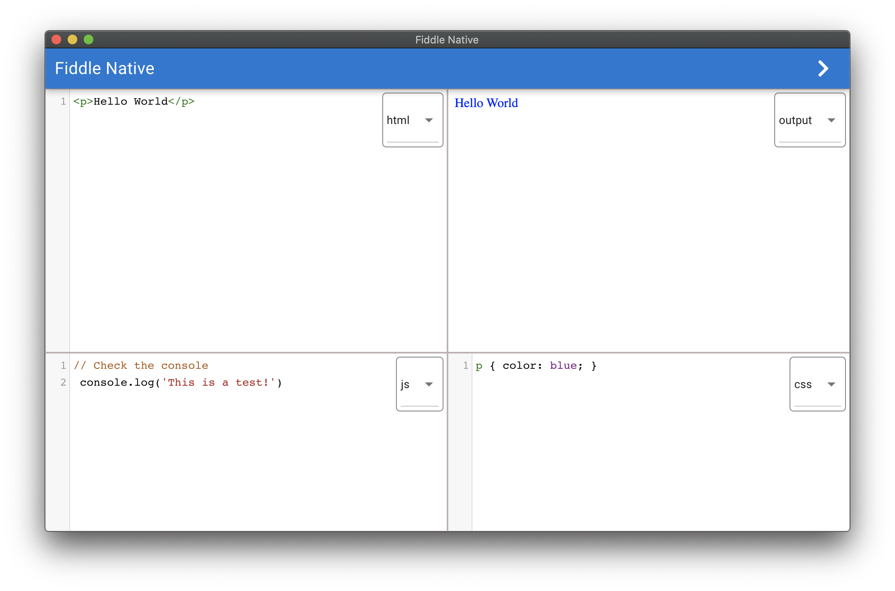

# Fiddle Native

Fiddle Native is a solution to building quick demos or other cool things just like you are accustomed to with other online tools, however being an native app, you don't have to rely on an internet connection!

<p align="center">
  
</p>

## Getting Started

This project utilizes the [Quasar Framework](https://quasar-framework.org/) so refer to their [getting started](https://quasar-framework.org/guide/) documentation before continuing 🙂

```bash
# Install dependencies
# If you don't have yarn installed: `npm install --global yarn`
yarn install

# Launch and serve with live reload
yarn dev
```

## License

Licensed under the MIT License. See [here](https://github.com/CameronAdams777/fiddle-native/blob/master/LICENSE.txt).
